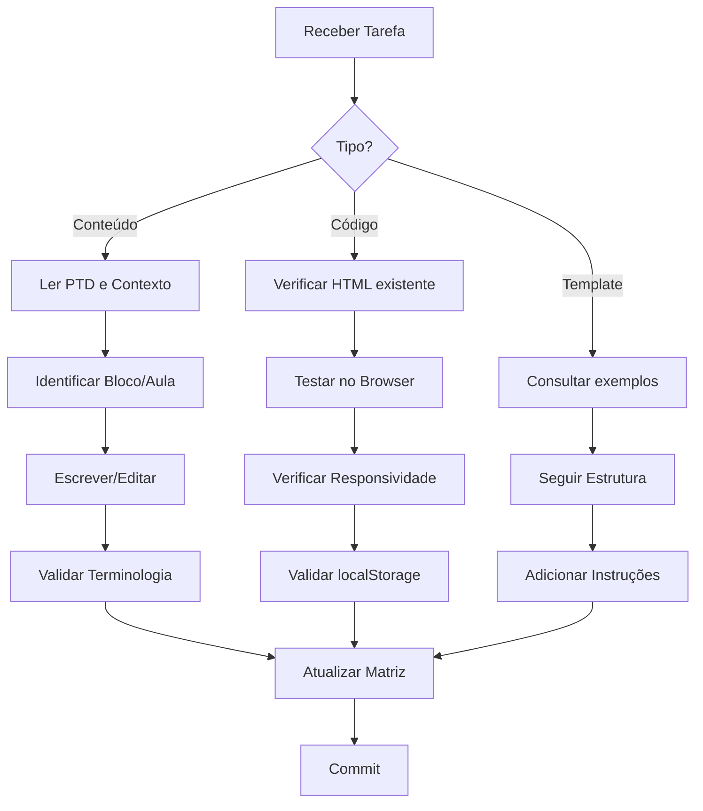

# 🤖 Instruções para Claude Code

## Contexto do Projeto

Este repositório contém material didático para o **Módulo 6 - Gestão de Projetos e Equipes de Dados** de um curso de pós-graduação em Gestão Estratégica de Dados.

---

## 📋 Regras Fundamentais

### Idioma e Terminologia
```
✅ TODO o conteúdo deve ser em português brasileiro
✅ Termos técnicos de TI/dados devem ser mantidos em inglês
✅ Exemplos: "data pipeline", "stakeholder", "sprint", "backlog", "deploy"
❌ Nunca traduzir: "encanamento de dados", "partes interessadas"
```

### Tom e Estilo
- **Profissional mas acessível** - conteúdo de pós-graduação
- **Prático e aplicável** - exemplos reais, não teóricos
- **Equilibrado** - atender técnicos E gestores simultaneamente

---

## 🏗️ Estrutura de Arquivos

### Documentos de Curso (`docs/curso/`)
Arquivos com estrutura pedagógica formal:
- PTD (Plano de Trabalho Docente)
- Estruturas de vídeo
- Storyboards de aulas
- Análises pedagógicas

**Ao editar:** Manter hierarquia de aulas, blocos e temas. Respeitar carga horária total de 30h.

### Documentos de Produção (`docs/producao/`)
Arquivos para equipe de gravação:
- Checklists de gravação
- Guias de instrutor
- Matrizes de rastreabilidade

**Ao editar:** Manter formato de checklist. Incluir estimativas de tempo.

### Recursos Educacionais (`docs/recursos/`)
Material complementar para alunos:
- Glossários
- Cases PBL
- Simuladores de IA
- Guias de ferramentas

**Ao editar:** Manter exemplos de empresas brasileiras. Atualizar ferramentas conforme mercado.

### Templates (`templates/`)
Modelos reutilizáveis em Markdown:
- Checklists operacionais
- Templates de documentos
- Estruturas Notion

**Ao editar:** Manter formato copiável. Incluir instruções de uso.

### Assets HTML (`assets/html/`)
Aplicações interativas standalone:
- Dashboards
- Frameworks interativos

**Ao editar:** Manter JavaScript vanilla. Usar localStorage para persistência. Não requer servidor.

---

## 🎯 Tarefas Comuns

### 1. Adicionar Nova Aula

```bash
# Localização do conteúdo de vídeos
docs/curso/modulo6_estrutura_videos.md

# Localização dos storyboards detalhados
docs/curso/modulo6_storyboards.md
```

**Checklist:**
- [ ] Definir bloco (1-3) e número da aula
- [ ] Duração entre 45-60 minutos
- [ ] Incluir objetivos de aprendizagem (verbos de ação)
- [ ] Adicionar case real de empresa
- [ ] Criar exercício prático
- [ ] Atualizar matriz de rastreabilidade

### 2. Criar Novo Case PBL

```bash
# Localização
docs/recursos/modulo6_pbl_cases.md
```

**Estrutura obrigatória:**
```markdown
## Case: [Nome da Empresa] - [Título do Desafio]

### Contexto
[Descrição da empresa e cenário - 2-3 parágrafos]

### Desafio
[Problema específico a ser resolvido]

### Dados Disponíveis
- [Lista de dados/recursos disponíveis]

### Restrições
- [Tempo, budget, equipe, tecnologia]

### Questões para Discussão
1. [Questão estratégica]
2. [Questão técnica]
3. [Questão de liderança]

### Desfecho Real (Spoiler)
[O que a empresa realmente fez - esconder em toggle se possível]
```

### 3. Adicionar Termo ao Glossário

```bash
# Localização
docs/recursos/modulo6_glossario.md
```

**Formato:**
```markdown
### [Termo em Inglês] / [Tradução se houver]

**Definição:** [Explicação clara e concisa]

**Contexto de uso:** [Quando/como é usado em projetos de dados]

**Exemplo:** [Frase de exemplo em contexto real]

**Relacionados:** [Termos correlatos]
```

### 4. Criar Simulador de IA

```bash
# Localização
docs/recursos/modulo6_simuladores_ia.md
```

**Estrutura do prompt:**
```markdown
## Simulador: [Nome do Cenário]

### Objetivo de Aprendizagem
[O que o aluno praticará]

### Setup do Cenário
[Contexto para o aluno assumir]

### Prompt para IA (Claude/ChatGPT)

```
Você é [PAPEL], [características do personagem].

CONTEXTO:
[Situação detalhada]

COMPORTAMENTO:
- [Como reagir]
- [Objeções comuns]
- [Gatilhos emocionais]

OBJETIVO OCULTO:
[O que o "personagem" realmente quer]

Inicie a conversa com: "[Primeira fala]"
```

### Critérios de Sucesso
- [ ] [Critério 1]
- [ ] [Critério 2]
```

### 5. Atualizar Dashboard HTML

```bash
# Localização
assets/html/modulo6_dashboard_aluno.html
assets/html/modulo6_dashboard_producao.html
```

**Padrões de código:**
```javascript
// Usar localStorage para persistência
localStorage.setItem('key', JSON.stringify(data));

// Estrutura de dados padrão
const progressData = {
  lessonId: 'bloco1_aula1',
  completed: true,
  timestamp: Date.now(),
  timeSpent: 2700 // segundos
};

// Convenção de IDs
// Formato: bloco{N}_aula{N}_{descricao}
```

**CSS Guidelines:**
```css
/* Paleta de cores */
--primary: #2563eb;     /* Azul principal */
--success: #16a34a;     /* Verde progresso */
--warning: #d97706;     /* Amarelo atenção */
--danger: #dc2626;      /* Vermelho erro */
--neutral: #64748b;     /* Cinza texto */

/* Responsividade obrigatória */
@media (max-width: 768px) { ... }
```

---

## 🔍 Comandos Úteis

### Validar Estrutura do Repositório
```bash
# Verificar se todos os arquivos existem
find . -name "*.md" -o -name "*.html" | wc -l
# Esperado: ~27 arquivos

# Verificar links quebrados em Markdown
grep -r "\[.*\](.*)" docs/ | grep -v "http"
```

### Gerar Sumário de Conteúdo
```bash
# Listar todos os headers H1 e H2
grep -h "^#\{1,2\} " docs/**/*.md
```

### Validar Mermaid
```bash
# Os diagramas estão em:
docs/recursos/modulo6_diagramas.md

# Testar no Mermaid Live Editor:
# https://mermaid.live/
```

---

## ⚠️ Pontos de Atenção

### Não Fazer
```
❌ Traduzir termos técnicos consolidados
❌ Remover cases de empresas brasileiras
❌ Alterar carga horária total (30h)
❌ Misturar conteúdo de diferentes blocos
❌ Usar bibliotecas externas nos HTMLs (manter vanilla)
❌ Adicionar backend/servidor aos dashboards
```

### Sempre Fazer
```
✅ Manter consistência de formatação Markdown
✅ Testar HTMLs no navegador após alterações
✅ Atualizar matriz de rastreabilidade
✅ Incluir exemplos práticos em todo conteúdo
✅ Validar diagramas Mermaid
✅ Manter dois públicos-alvo em mente
```

---

## 📊 Métricas de Qualidade

### Para Conteúdo Escrito
- Parágrafos: máximo 5 linhas
- Listas: máximo 7 itens por nível
- Exemplos: mínimo 1 por conceito
- Cases reais: preferir empresas brasileiras

### Para Código HTML/JS
- Sem dependências externas (CDN ok para ícones)
- Funcionar offline
- Responsivo (mobile-first)
- Acessível (ARIA labels onde aplicável)

### Para Diagramas
- Mermaid syntax válida
- Máximo 15 nós por diagrama
- Legendas em português
- Cores consistentes com paleta

---

## 🔄 Fluxo de Trabalho Recomendado



---

## 📚 Referências Internas

| Necessidade | Arquivo |
|-------------|---------|
| Estrutura completa do módulo | `docs/curso/modulo6_ptd_30h.md` |
| Como gravar vídeos | `docs/producao/modulo6_guia_instrutor.md` |
| Vocabulário técnico | `docs/recursos/modulo6_glossario.md` |
| Ferramentas do mercado | `docs/recursos/modulo6_guia_ferramentas.md` |
| Exemplos de cases | `docs/recursos/modulo6_pbl_cases.md` |
| Prompts de simulação | `docs/recursos/modulo6_simuladores_ia.md` |

---

## 💡 Dicas para Claude Code

1. **Ao receber tarefa ambígua:** Consulte primeiro o PTD (`docs/curso/modulo6_ptd_30h.md`)

2. **Ao criar conteúdo novo:** Verifique se já existe algo similar antes de criar do zero

3. **Ao editar HTML:** Sempre teste abrindo o arquivo diretamente no browser

4. **Ao adicionar termos:** Mantenha glossário e conteúdo sincronizados

5. **Ao duvidar do público:** Lembre que são dois perfis - técnico→gestor E gestor→dados

---

*Documento atualizado em Janeiro 2026*
