# 📊 DIAGRAMAS DE ARQUITETURA • MÓDULO 6
## 3 Diagramas em Mermaid para Visualização Técnica

---

## 📋 ÍNDICE

1. [Diagrama 1: Arquitetura de Dados Moderna](#diagrama-1-arquitetura-de-dados-moderna)
2. [Diagrama 2: Fluxo de Projeto de Dados](#diagrama-2-fluxo-de-projeto-de-dados)
3. [Diagrama 3: Estrutura Organizacional de Dados](#diagrama-3-estrutura-organizacional-de-dados)

---

# DIAGRAMA 1: ARQUITETURA DE DADOS MODERNA

## Descrição
Visão completa de uma arquitetura de dados moderna, desde fontes até consumo, incluindo camadas de ingestão, armazenamento, transformação e serving.

## Código Mermaid



```mermaid
flowchart TB
    subgraph SOURCES["📥 FONTES DE DADOS"]
        direction LR
        ERP["🏢 ERP<br/>SAP/Oracle"]
        CRM["👥 CRM<br/>Salesforce"]
        WEB["🌐 Web/App<br/>Eventos"]
        API["🔌 APIs<br/>Parceiros"]
        IOT["📡 IoT<br/>Sensores"]
    end

    subgraph INGESTION["⚙️ INGESTÃO"]
        direction LR
        BATCH["📦 Batch<br/>Airbyte/Fivetran"]
        STREAM["🌊 Streaming<br/>Kafka/Kinesis"]
        CDC["🔄 CDC<br/>Debezium"]
    end

    subgraph STORAGE["💾 ARMAZENAMENTO"]
        direction TB
        subgraph LAKE["🏞️ Data Lake"]
            RAW["📂 Raw<br/>Bronze"]
            CLEAN["📂 Cleaned<br/>Silver"]
            CURATED["📂 Curated<br/>Gold"]
        end
        DW["🏛️ Data Warehouse<br/>Snowflake/BigQuery"]
    end

    subgraph TRANSFORM["🔄 TRANSFORMAÇÃO"]
        direction LR
        DBT["🔧 dbt<br/>SQL Models"]
        SPARK["âš¡ Spark<br/>Heavy Processing"]
        AIRFLOW["📅 Airflow<br/>Orchestration"]
    end

    subgraph SERVING["🎯 SERVING"]
        direction LR
        SEMANTIC["📊 Semantic Layer<br/>Metrics Store"]
        FEATURE["🧮 Feature Store<br/>ML Features"]
        CACHE["âš¡ Cache<br/>Redis"]
    end

    subgraph CONSUME["👥 CONSUMO"]
        direction LR
        BI["📈 BI Tools<br/>Power BI/Looker"]
        NOTEBOOK["📓 Notebooks<br/>Jupyter/Colab"]
        APP["📱 Aplicações<br/>APIs/Dashboards"]
        ML["🤖 ML Models<br/>Predictions"]
    end

    subgraph GOVERNANCE["🛡️ GOVERNANÇA"]
        direction LR
        CATALOG["📚 Data Catalog<br/>DataHub"]
        QUALITY["✅ Data Quality<br/>Great Expectations"]
        SECURITY["🔒 Security<br/>IAM/Masking"]
        LINEAGE["🔗 Lineage<br/>Tracking"]
    end

    %% Connections
    ERP --> BATCH
    CRM --> BATCH
    WEB --> STREAM
    API --> CDC
    IOT --> STREAM

    BATCH --> RAW
    STREAM --> RAW
    CDC --> RAW

    RAW --> CLEAN
    CLEAN --> CURATED
    CURATED --> DW

    RAW --> SPARK
    SPARK --> CLEAN
    CLEAN --> DBT
    DBT --> CURATED
    AIRFLOW -.->|orchestrates| DBT
    AIRFLOW -.->|orchestrates| SPARK

    DW --> SEMANTIC
    CURATED --> FEATURE
    SEMANTIC --> CACHE

    SEMANTIC --> BI
    FEATURE --> ML
    CACHE --> APP
    DW --> NOTEBOOK

    %% Governance connections
    CATALOG -.->|catalogs| DW
    QUALITY -.->|validates| CURATED
    LINEAGE -.->|tracks| TRANSFORM
    SECURITY -.->|protects| STORAGE

    %% Styling
    classDef sources fill:#e1f5fe,stroke:#01579b
    classDef ingestion fill:#fff3e0,stroke:#e65100
    classDef storage fill:#f3e5f5,stroke:#7b1fa2
    classDef transform fill:#e8f5e9,stroke:#2e7d32
    classDef serving fill:#fce4ec,stroke:#c2185b
    classDef consume fill:#e3f2fd,stroke:#1565c0
    classDef governance fill:#fff8e1,stroke:#f9a825

    class ERP,CRM,WEB,API,IOT sources
    class BATCH,STREAM,CDC ingestion
    class RAW,CLEAN,CURATED,DW storage
    class DBT,SPARK,AIRFLOW transform
    class SEMANTIC,FEATURE,CACHE serving
    class BI,NOTEBOOK,APP,ML consume
    class CATALOG,QUALITY,SECURITY,LINEAGE governance
```

## Descrição das Camadas

| Camada | Componentes | Responsabilidade |
|--------|-------------|------------------|
| **Fontes** | ERP, CRM, Web, APIs, IoT | Sistemas de origem dos dados |
| **Ingestão** | Airbyte, Kafka, Debezium | Captura e transporte de dados |
| **Armazenamento** | Data Lake (Bronze/Silver/Gold), DW | Persistência organizada |
| **Transformação** | dbt, Spark, Airflow | Processamento e orquestração |
| **Serving** | Semantic Layer, Feature Store | Disponibilização otimizada |
| **Consumo** | BI, Notebooks, Apps, ML | Uso final dos dados |
| **Governança** | Catalog, Quality, Security | Gestão transversal |

## Ferramentas por Camada

| Camada | Open Source | Enterprise |
|--------|-------------|------------|
| Ingestão | Airbyte, Kafka | Fivetran, Confluent |
| Lake | MinIO, Delta Lake | S3, ADLS, GCS |
| DW | ClickHouse, DuckDB | Snowflake, BigQuery, Redshift |
| Transform | dbt Core, Airflow | dbt Cloud, Astronomer |
| Catalog | DataHub, OpenMetadata | Alation, Collibra |
| BI | Metabase, Superset | Looker, Power BI, Tableau |

---

# DIAGRAMA 2: FLUXO DE PROJETO DE DADOS

## Descrição
Fluxo completo de um projeto de dados, desde a solicitação até a operação, com gates de decisão e artefatos de cada fase.

## Código Mermaid



```mermaid
flowchart TD
    subgraph REQUEST["📨 SOLICITAÇÃO"]
        REQ_IN["Pedido chega<br/>via Slack/Jira"]
        TRIAGE["Triagem<br/>PM avalia"]
        REQ_IN --> TRIAGE
    end

    GATE1{{"🚦 GATE 1<br/>Vale fazer?"}}
    TRIAGE --> GATE1

    GATE1 -->|"❌ Não"| BACKLOG["📋 Ice Box<br/>Baixa prioridade"]
    GATE1 -->|"✅ Sim"| DISCOVERY

    subgraph DISCOVERY["🔍 DISCOVERY (1-2 sem)"]
        direction TB
        UNDERSTAND["Entender<br/>problema"]
        DATA_ASSESS["Avaliar<br/>dados disponíveis"]
        FEASIBILITY["Análise de<br/>viabilidade"]
        UNDERSTAND --> DATA_ASSESS --> FEASIBILITY
    end

    GATE2{{"🚦 GATE 2<br/>Viável?"}}
    FEASIBILITY --> GATE2

    GATE2 -->|"❌ Não"| CANCEL["🚫 Cancelar<br/>Documentar motivo"]
    GATE2 -->|"✅ Sim"| PLANNING

    subgraph PLANNING["📋 PLANNING (1-2 sem)"]
        direction TB
        CHARTER["Project Charter"]
        RACI["Matriz RACI"]
        ROADMAP["Roadmap"]
        RISKS["Risk Register"]
        CHARTER --> RACI --> ROADMAP --> RISKS
    end

    GATE3{{"🚦 GATE 3<br/>Plano aprovado?"}}
    RISKS --> GATE3

    GATE3 -->|"🔄 Ajustar"| PLANNING
    GATE3 -->|"✅ Sim"| EXECUTION

    subgraph EXECUTION["💻 EXECUTION (4-8 sem)"]
        direction TB
        
        subgraph SPRINT["Sprint 1-N"]
            PLAN_S["Planning"]
            DEV["Desenvolvimento"]
            REVIEW_S["Review"]
            RETRO["Retro"]
            PLAN_S --> DEV --> REVIEW_S --> RETRO
        end
        
        SPRINT --> |"Próximo Sprint"| SPRINT
    end

    GATE4{{"🚦 GATE 4<br/>Escopo concluído?"}}
    SPRINT --> GATE4

    GATE4 -->|"🔄 Continuar"| SPRINT
    GATE4 -->|"✅ Sim"| VALIDATION

    subgraph VALIDATION["✅ VALIDATION (1-2 sem)"]
        direction TB
        TESTS["Testes de<br/>Qualidade"]
        UAT["UAT com<br/>Usuários"]
        FIXES["Correções<br/>Finais"]
        TESTS --> UAT --> FIXES
    end

    GATE5{{"🚦 GATE 5<br/>Aceito?"}}
    FIXES --> GATE5

    GATE5 -->|"🔄 Ajustar"| FIXES
    GATE5 -->|"✅ Sim"| DEPLOY

    subgraph DEPLOY["🚀 DEPLOY (1 sem)"]
        direction TB
        DOCS["Documentação"]
        TRAINING["Treinamento"]
        GOLIVE["Go-Live"]
        DOCS --> TRAINING --> GOLIVE
    end

    subgraph OPERATE["📈 OPERATE (contínuo)"]
        direction TB
        MONITOR["Monitoramento"]
        SUPPORT["Suporte"]
        IMPROVE["Melhorias"]
        MONITOR --> SUPPORT --> IMPROVE
        IMPROVE -->|"Nova demanda"| REQ_IN
    end

    GOLIVE --> OPERATE

    %% Artefatos (notas)
    CHARTER -.- NOTE1["📄 Escopo, objetivos,<br/>stakeholders, timeline"]
    RACI -.- NOTE2["📄 Responsável, Accountable,<br/>Consultado, Informado"]
    TESTS -.- NOTE3["📄 Testes automatizados,<br/>data quality checks"]

    %% Styling
    classDef gate fill:#fff3e0,stroke:#e65100,stroke-width:2px
    classDef phase fill:#e3f2fd,stroke:#1565c0
    classDef artifact fill:#f5f5f5,stroke:#9e9e9e,stroke-dasharray: 5 5

    class GATE1,GATE2,GATE3,GATE4,GATE5 gate
    class REQUEST,DISCOVERY,PLANNING,EXECUTION,VALIDATION,DEPLOY,OPERATE phase
    class NOTE1,NOTE2,NOTE3 artifact
```

## Gates de Decisão Detalhados

| Gate | Pergunta | Critérios de Aprovação | Quem Decide |
|------|----------|------------------------|-------------|
| **Gate 1** | Vale fazer? | ROI positivo, alinhado com OKRs | PM + Sponsor |
| **Gate 2** | É viável? | Dados disponíveis, skills existem, prazo realista | Tech Lead + PM |
| **Gate 3** | Plano aprovado? | Charter assinado, RACI definido, riscos mitigáveis | Sponsor |
| **Gate 4** | Escopo concluído? | DoD atendido, testes passando | PM + Tech Lead |
| **Gate 5** | Aceito pelo usuário? | UAT aprovado, documentação completa | Usuário + Sponsor |

## Artefatos por Fase

| Fase | Artefatos Obrigatórios | Templates |
|------|------------------------|-----------|
| Discovery | Business Case, Data Assessment | modulo6_templates |
| Planning | Charter, RACI, Roadmap, Risks | modulo6_templates |
| Execution | Sprint Backlog, DoD, Burndown | Jira/Notion |
| Validation | Test Cases, UAT Sign-off | modulo6_checklists |
| Deploy | Runbook, Training Materials | Confluence |
| Operate | SLA, Alerts Config, Metrics | DataDog/Grafana |

---

# DIAGRAMA 3: ESTRUTURA ORGANIZACIONAL DE DADOS

## Descrição
Três modelos de estrutura organizacional para times de dados: Centralizado, Descentralizado e Híbrido (Hub & Spoke).

## Código Mermaid

### Modelo A: Centralizado

```mermaid
flowchart TB
    subgraph CENTRAL["🏛️ MODELO CENTRALIZADO"]
        direction TB
        
        CDO["👔 CDO"]
        
        subgraph DATA_TEAM["📊 Time Central de Dados"]
            MGR["👤 Data Manager"]
            
            subgraph ENGINEERS["⚙️ Engineering"]
                DE1["Data Engineer"]
                DE2["Data Engineer"]
                AE1["Analytics Engineer"]
            end
            
            subgraph ANALYTICS["📈 Analytics"]
                DA1["Data Analyst"]
                DA2["Data Analyst"]
                DA3["Data Analyst"]
            end
            
            subgraph SCIENCE["🔬 Science"]
                DS1["Data Scientist"]
                DS2["ML Engineer"]
            end
            
            MGR --> ENGINEERS
            MGR --> ANALYTICS
            MGR --> SCIENCE
        end
        
        CDO --> DATA_TEAM
        
        subgraph BIZ["🏢 Áreas de Negócio"]
            direction LR
            SALES["Sales"]
            MKT["Marketing"]
            FIN["Finance"]
            OPS["Operations"]
        end
        
        DATA_TEAM -->|"Atende todas<br/>as áreas"| BIZ
    end

    PROS1["✅ Padronização<br/>✅ Economia de escala<br/>✅ Visão holística"]
    CONS1["❌ Gargalo central<br/>❌ Distante do negócio<br/>❌ Priorização difícil"]
    
    CENTRAL --- PROS1
    CENTRAL --- CONS1
```



### Modelo B: Descentralizado (Embedded)

```mermaid
flowchart TB
    subgraph EMBEDDED["🌐 MODELO DESCENTRALIZADO"]
        direction TB
        
        CEO["👔 CEO"]
        
        subgraph SALES_TEAM["💼 Sales"]
            S_HEAD["VP Sales"]
            S_DATA["📊 Data Analyst"]
            S_HEAD --> S_DATA
        end
        
        subgraph MKT_TEAM["📣 Marketing"]
            M_HEAD["VP Marketing"]
            M_DS["🔬 Data Scientist"]
            M_DA["📊 Data Analyst"]
            M_HEAD --> M_DS
            M_HEAD --> M_DA
        end
        
        subgraph FIN_TEAM["💰 Finance"]
            F_HEAD["CFO"]
            F_DA["📊 Data Analyst"]
            F_HEAD --> F_DA
        end
        
        subgraph PROD_TEAM["🛠️ Product"]
            P_HEAD["VP Product"]
            P_DE["⚙️ Data Engineer"]
            P_DS["🔬 Data Scientist"]
            P_HEAD --> P_DE
            P_HEAD --> P_DS
        end
        
        CEO --> SALES_TEAM
        CEO --> MKT_TEAM
        CEO --> FIN_TEAM
        CEO --> PROD_TEAM
    end

    PROS2["✅ Próximo ao negócio<br/>✅ Contexto profundo<br/>✅ Agilidade local"]
    CONS2["❌ Silos de dados<br/>❌ Inconsistência<br/>❌ Duplicação de esforço"]
    
    EMBEDDED --- PROS2
    EMBEDDED --- CONS2
```



### Modelo C: Híbrido (Hub & Spoke)

```mermaid
flowchart TB
    subgraph HYBRID["⚡ MODELO HÍBRIDO (HUB & SPOKE)"]
        direction TB
        
        CDO["👔 CDO"]
        
        subgraph HUB["🎯 HUB CENTRAL"]
            direction TB
            PLATFORM["🏗️ Platform Team"]
            GOVERNANCE["🛡️ Governance"]
            COE["📚 Centro de<br/>Excelência"]
            
            subgraph PLAT_TEAM["Platform"]
                PDE1["Data Engineer"]
                PDE2["Data Engineer"]
                PAE["Analytics Engineer"]
            end
            
            PLATFORM --> PLAT_TEAM
        end
        
        CDO --> HUB
        
        subgraph SPOKES["🔄 SPOKES (Embedded)"]
            direction LR
            
            subgraph S_SALES["Sales Spoke"]
                SS_DA["📊 Analyst"]
            end
            
            subgraph S_MKT["Marketing Spoke"]
                SM_DS["🔬 Scientist"]
                SM_DA["📊 Analyst"]
            end
            
            subgraph S_PROD["Product Spoke"]
                SP_DS["🔬 Scientist"]
                SP_MLE["🤖 ML Engineer"]
            end
        end
        
        HUB <-->|"Padrões<br/>Ferramentas<br/>Suporte"| SPOKES
        
        %% Governance connections
        GOVERNANCE -.->|"Data Quality"| S_SALES
        GOVERNANCE -.->|"Data Quality"| S_MKT
        GOVERNANCE -.->|"Data Quality"| S_PROD
        
        COE -.->|"Best Practices<br/>Training"| SPOKES
    end

    PROS3["✅ Equilíbrio ideal<br/>✅ Padronização + Proximidade<br/>✅ Escalável"]
    CONS3["⚠️ Governança complexa<br/>⚠️ Coordenação necessária<br/>⚠️ Requer maturidade"]
    
    HYBRID --- PROS3
    HYBRID --- CONS3
```



## Comparativo dos Modelos

```mermaid
quadrantChart
    title Comparativo de Modelos Organizacionais
    x-axis Distante do Negócio --> Próximo do Negócio
    y-axis Baixa Padronização --> Alta Padronização
    quadrant-1 Hub & Spoke
    quadrant-2 Centralizado
    quadrant-3 Ad-hoc
    quadrant-4 Descentralizado
    Centralizado: [0.25, 0.85]
    Descentralizado: [0.85, 0.25]
    Hub & Spoke: [0.70, 0.75]
    Data Mesh: [0.90, 0.65]
```



## Matriz de Decisão

| Critério | Centralizado | Descentralizado | Hub & Spoke |
|----------|:------------:|:---------------:|:-----------:|
| **Tamanho ideal** | <50 pessoas dados | Qualquer | >20 pessoas dados |
| **Maturidade necessária** | Baixa | Média | Alta |
| **Padronização** | ⭐⭐⭐ | ⭐ | ⭐⭐⭐ |
| **Agilidade local** | ⭐ | ⭐⭐⭐ | ⭐⭐ |
| **Contexto de negócio** | ⭐ | ⭐⭐⭐ | ⭐⭐ |
| **Governança** | ⭐⭐⭐ | ⭐ | ⭐⭐⭐ |
| **Custo** | 💰 | 💰💰💰 | 💰💰 |

## Evolução Típica

```mermaid
timeline
    title Jornada de Evolução Organizacional
    
    section Início (0-2 anos)
        Ad-hoc : Analistas isolados
                : Planilhas
                : Sem padrão
    
    section Estruturação (2-4 anos)
        Centralizado : Time único
                     : Primeiras ferramentas
                     : Processos básicos
    
    section Escala (4-6 anos)
        Hub & Spoke : Plataforma central
                    : Especialistas embedded
                    : Governança federada
    
    section Maturidade (6+ anos)
        Data Mesh : Domínios autônomos
                  : Dados como produto
                  : Self-service total
```



---

# 🛠️ COMO USAR OS DIAGRAMAS

## Renderização

### Opção 1: Mermaid Live Editor
1. Acesse: https://mermaid.live
2. Cole o código Mermaid
3. Exporte como PNG ou SVG

### Opção 2: VS Code
1. Instale extensão "Mermaid Preview"
2. Abra arquivo .md com o código
3. Use preview para visualizar

### Opção 3: Notion / Confluence
1. Use bloco de código com linguagem "mermaid"
2. Renderização automática

### Opção 4: GitHub
1. Arquivos .md renderizam Mermaid automaticamente
2. Use em READMEs e documentação

## Customização

### Cores
```mermaid
%%{init: {'theme': 'base', 'themeVariables': { 'primaryColor': '#1E3A5F', 'secondaryColor': '#6B4C9A'}}}%%
```

### Direção
- `TB` = Top to Bottom (vertical)
- `LR` = Left to Right (horizontal)
- `BT` = Bottom to Top
- `RL` = Right to Left

## Dicas de Apresentação

1. **Para slides:** Exporte como SVG para qualidade máxima
2. **Para docs:** Use PNG com fundo transparente
3. **Para web:** Embed direto com biblioteca Mermaid.js
4. **Para impressão:** PDF vetorial via exportação

---

**Total:** 3 diagramas técnicos com múltiplas variações

**Versão:** 1.0 • Módulo 6 • Gestão de Projetos e Equipes de Dados
