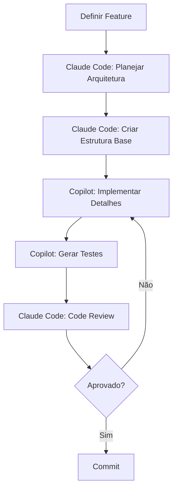
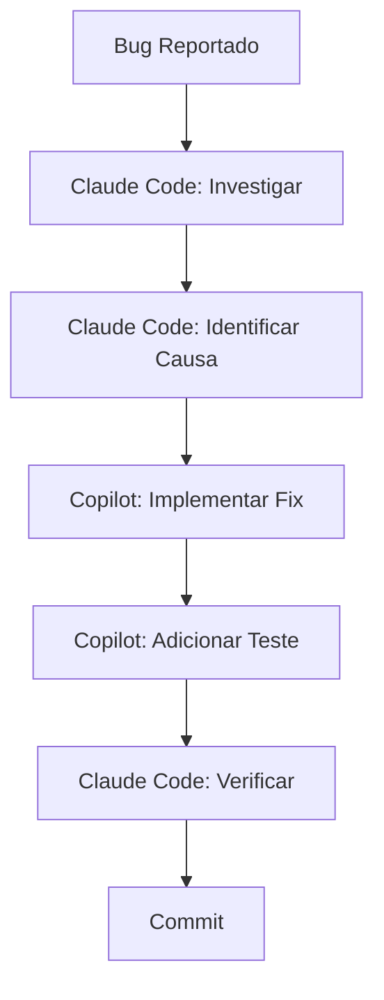
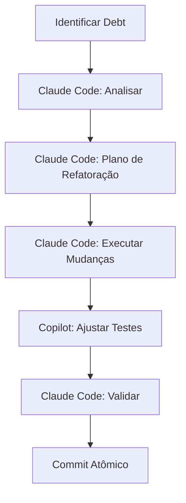

# 🚀 Guia de Estratégia: Copilot + Claude Code

## Melhores Práticas para Codificação Assistida por IA

---

## 📋 Índice

1. [Visão Geral das Ferramentas](#visão-geral)
2. [Quando Usar Cada Uma](#quando-usar)
3. [Prompts Iniciais](#prompts-iniciais)
4. [Fluxos de Trabalho](#fluxos-de-trabalho)
5. [Estratégias Combinadas](#estratégias-combinadas)
6. [Anti-Patterns a Evitar](#anti-patterns)

---

## 🎯 Visão Geral das Ferramentas {#visão-geral}

### GitHub Copilot

| Aspecto | Característica |
|---------|----------------|
| **Força Principal** | Autocompletar código em tempo real |
| **Melhor Para** | Código incremental, boilerplate, patterns conhecidos |
| **Contexto** | Arquivo atual + arquivos abertos |
| **Interação** | Inline (Tab) + Chat |
| **Velocidade** | Instantânea |

### Claude Code

| Aspecto | Característica |
|---------|----------------|
| **Força Principal** | Raciocínio complexo e refatoração |
| **Melhor Para** | Arquitetura, debugging, código multi-arquivo |
| **Contexto** | Projeto inteiro + comandos shell |
| **Interação** | Terminal/CLI + Conversa |
| **Velocidade** | Mais deliberada |

---

## ⚖️ Quando Usar Cada Uma {#quando-usar}

```
┌─────────────────────────────────────────────────────────────────┐
│                    MATRIZ DE DECISÃO                            │
├─────────────────────────────────────────────────────────────────┤
│                                                                 │
│   COPILOT                          CLAUDE CODE                  │
│   ════════                         ═══════════                  │
│                                                                 │
│   ✓ Completar linha/função         ✓ Criar arquivo do zero     │
│   ✓ Escrever testes unitários      ✓ Refatorar múltiplos arqs  │
│   ✓ Gerar boilerplate              ✓ Debugging complexo        │
│   ✓ Implementar interface          ✓ Explicar código legado    │
│   ✓ Código repetitivo              ✓ Decisões arquiteturais    │
│   ✓ Regex e queries                ✓ Code review               │
│   ✓ Documentação inline            ✓ Migração de código        │
│   ✓ Snippets rápidos               ✓ Integração de sistemas    │
│                                                                 │
│   VELOCIDADE ←──────────────────────────→ PROFUNDIDADE         │
│                                                                 │
└─────────────────────────────────────────────────────────────────┘
```

### Regra de Ouro

> **Copilot** = "O que vem depois desta linha?"
> **Claude Code** = "Como resolvo este problema?"

---

## 🎬 Prompts Iniciais {#prompts-iniciais}

### Para Claude Code - Onboarding no Projeto

```bash
# Prompt 1: Apresentação do Projeto
claude

# Depois, cole este prompt:
```

```markdown
Olá! Vamos trabalhar juntos neste projeto. Antes de começar, preciso que você:

1. **Analise a estrutura** do repositório:
   - Leia o README.md
   - Identifique os arquivos de configuração (.cursorrules, CLAUDE.md, etc)
   - Mapeie a arquitetura de diretórios

2. **Entenda o contexto**:
   - Qual o propósito do projeto?
   - Quais tecnologias são usadas?
   - Quais padrões de código devo seguir?

3. **Me diga**:
   - Principais pontos de atenção
   - Dependências críticas
   - Áreas que precisam de cuidado

Comece explorando com `ls` e `cat` nos arquivos principais.
```

---

### Para Claude Code - Início de Sessão Diária

```markdown
Continuando o trabalho no projeto [NOME].

**Contexto da sessão anterior:**
- [O que foi feito]
- [O que ficou pendente]

**Objetivo de hoje:**
- [ ] [Tarefa 1]
- [ ] [Tarefa 2]

**Restrições:**
- Não modificar [arquivo/módulo]
- Manter compatibilidade com [versão/sistema]

Antes de começar, confirme que entendeu o escopo.
```

---

### Para Claude Code - Debugging

```markdown
Preciso de ajuda para debugar um problema.

**Sintoma:**
[Descreva o comportamento incorreto]

**Comportamento esperado:**
[O que deveria acontecer]

**Contexto:**
- Arquivo: [caminho]
- Função/Componente: [nome]
- Última alteração: [o que mudou]

**Já tentei:**
- [Tentativa 1]
- [Tentativa 2]

Investigue sistematicamente. Leia o código relevante antes de sugerir soluções.
```

---

### Para Claude Code - Refatoração

```markdown
Quero refatorar [módulo/componente].

**Situação atual:**
- [Descreva os problemas]
- Arquivos envolvidos: [lista]

**Objetivos:**
- [ ] [Melhoria 1]
- [ ] [Melhoria 2]

**Restrições:**
- Manter interface pública intacta
- Não quebrar testes existentes
- [Outras restrições]

**Abordagem:**
1. Primeiro, analise o código atual
2. Proponha um plano de refatoração
3. Aguarde minha aprovação antes de implementar
```

---

### Para Copilot Chat - Contexto Inicial

```markdown
/explain Analise este arquivo e me diga:
1. Qual o propósito principal
2. Dependências externas usadas
3. Padrões de código seguidos
4. Áreas que poderiam ser melhoradas
```

---

### Para Copilot Chat - Geração de Código

```markdown
Preciso criar [descrição do componente].

Requisitos:
- [Requisito 1]
- [Requisito 2]

Padrões a seguir:
- [Padrão do projeto]

Use os mesmos patterns dos outros arquivos neste diretório.
```

---

### Para Copilot Chat - Testes

```markdown
/tests Gere testes para esta função considerando:
- Casos de sucesso
- Casos de erro/edge cases
- Mocks necessários

Siga o padrão de testes existente no projeto.
```

---

## 🔄 Fluxos de Trabalho {#fluxos-de-trabalho}

### Fluxo 1: Feature Nova (Complexa)



**Passo a passo:**

1. **Claude Code** - Planejamento
```markdown
Preciso implementar [feature]. 
Analise o projeto e sugira:
- Onde adicionar novos arquivos
- Interfaces necessárias
- Impacto em código existente
```

2. **Claude Code** - Estrutura
```markdown
Crie a estrutura base:
- Arquivos necessários
- Interfaces/Types
- Stubs das funções principais
```

3. **Copilot** - Implementação
```
// Na IDE, use Tab para completar cada função
// Use comentários como guia:
// TODO: implementar validação de email
// TODO: chamar API de autenticação
```

4. **Copilot Chat** - Testes
```markdown
/tests para o arquivo auth.service.ts
```

5. **Claude Code** - Review
```markdown
Faça code review do que implementamos:
- Bugs potenciais
- Melhorias de performance
- Aderência aos padrões do projeto
```

---

### Fluxo 2: Bug Fix



**Passo a passo:**

1. **Claude Code** - Investigação
```markdown
Temos um bug: [descrição]

Reprodução:
1. [passo 1]
2. [passo 2]

Investigue o código relacionado e encontre a causa raiz.
```

2. **Copilot** - Fix rápido (na IDE)
```javascript
// Copilot completa baseado no contexto
if (user && user.isActive) {  // Tab para completar
```

3. **Claude Code** - Verificação
```markdown
Verifique se o fix não introduziu regressões.
Rode os testes e analise o resultado.
```

---

### Fluxo 3: Refatoração



---

## 🎯 Estratégias Combinadas {#estratégias-combinadas}

### Estratégia 1: "Architect + Builder"

```
┌────────────────────────────────────────────────────────┐
│                                                        │
│   CLAUDE CODE (Arquiteto)                              │
│   ═══════════════════════                              │
│   • Define estrutura                                   │
│   • Cria interfaces/contratos                          │
│   • Estabelece padrões                                 │
│   • Revisa decisões                                    │
│                                                        │
│              ↓ passa especificação ↓                   │
│                                                        │
│   COPILOT (Construtor)                                 │
│   ════════════════════                                 │
│   • Implementa funções                                 │
│   • Completa boilerplate                               │
│   • Gera testes                                        │
│   • Escreve documentação                               │
│                                                        │
└────────────────────────────────────────────────────────┘
```

**Exemplo prático:**

```markdown
# 1. Claude Code define a interface
Crie uma interface TypeScript para um serviço de cache com:
- get/set/delete
- TTL configurável
- Suporte a namespaces

# 2. Copilot implementa
// No arquivo cache.service.ts, escreva:
// implements ICacheService
// Copilot completa a implementação
```

---

### Estratégia 2: "Explore + Execute"

```
┌─────────────────────────────────────────────────────────┐
│                                                         │
│   FASE 1: EXPLORAÇÃO (Claude Code)                      │
│   ─────────────────────────────────                     │
│   "Analise este código legado e me explique:            │
│    - O que faz cada módulo                              │
│    - Dependências entre componentes                     │
│    - Riscos de modificação"                             │
│                                                         │
│   FASE 2: EXECUÇÃO (Copilot)                            │
│   ──────────────────────────                            │
│   Com o conhecimento adquirido, usar Copilot            │
│   para fazer modificações pontuais com confiança        │
│                                                         │
└─────────────────────────────────────────────────────────┘
```

---

### Estratégia 3: "Draft + Polish"

```
┌─────────────────────────────────────────────────────────┐
│                                                         │
│   FASE 1: RASCUNHO RÁPIDO (Copilot)                     │
│   ─────────────────────────────────                     │
│   Usar Copilot para gerar código rapidamente            │
│   Aceitar sugestões sem muito critério                  │
│   Foco em ter algo funcionando                          │
│                                                         │
│   FASE 2: POLIMENTO (Claude Code)                       │
│   ─────────────────────────────────                     │
│   "Revise este código e:                                │
│    - Melhore a legibilidade                             │
│    - Otimize performance                                │
│    - Adicione tratamento de erros                       │
│    - Garanta aderência aos padrões"                     │
│                                                         │
└─────────────────────────────────────────────────────────┘
```

---

### Estratégia 4: "Parallel Validation"

Use os dois para validar decisões críticas:

```markdown
# Pergunta para Claude Code:
"Qual a melhor forma de implementar autenticação JWT neste projeto?"

# Mesma pergunta para Copilot Chat:
"/explain qual a melhor abordagem para JWT auth considerando este projeto?"

# Compare as respostas e tome a decisão informada
```

---

## 🚫 Anti-Patterns a Evitar {#anti-patterns}

### ❌ Anti-Pattern 1: "Copy-Paste Cego"

```
ERRADO:
- Aceitar tudo que Copilot sugere sem ler
- Copiar código do Claude Code sem entender

CERTO:
- Ler cada sugestão antes de aceitar
- Entender o código antes de integrar
- Testar incrementalmente
```

### ❌ Anti-Pattern 2: "Context Switching Excessivo"

```
ERRADO:
- Alternar entre ferramentas a cada 2 minutos
- Perder contexto constantemente

CERTO:
- Usar Copilot para sessões de implementação
- Usar Claude Code para sessões de análise/planejamento
- Definir blocos de tempo para cada modo
```

### ❌ Anti-Pattern 3: "Prompt Vago"

```
ERRADO:
"Arruma esse código"
"Faz funcionar"
"Melhora isso"

CERTO:
"Refatore para extrair a lógica de validação para uma função separada"
"Adicione tratamento de erro para o caso de API offline"
"Otimize a query para evitar N+1"
```

### ❌ Anti-Pattern 4: "Ignorar o Contexto do Projeto"

```
ERRADO:
- Deixar a IA gerar código sem conhecer os padrões
- Não fornecer arquivos de referência

CERTO:
- Sempre iniciar sessão com onboarding
- Referenciar arquivos existentes como exemplo
- Manter arquivos de instruções atualizados
```

### ❌ Anti-Pattern 5: "Over-Engineering com IA"

```
ERRADO:
- Pedir soluções complexas para problemas simples
- Aceitar abstrações desnecessárias

CERTO:
- Começar simples
- Adicionar complexidade apenas quando necessário
- Questionar sugestões muito elaboradas
```

---

## 📊 Checklist de Sessão

### Início do Dia

```markdown
□ Abrir projeto na IDE
□ Verificar branches e status do git
□ Revisar tarefas do dia
□ Iniciar Claude Code com contexto do projeto
□ Confirmar que Copilot está ativo
```

### Durante Desenvolvimento

```markdown
□ Usar Copilot para código incremental
□ Parar para Claude Code em decisões complexas
□ Commitar em pontos estáveis
□ Documentar decisões importantes
```

### Fim do Dia

```markdown
□ Code review final com Claude Code
□ Garantir testes passando
□ Documentar contexto para próxima sessão
□ Push das mudanças
```

---

## 🎓 Dicas Avançadas

### 1. Crie Aliases para Prompts Frequentes

```bash
# No seu .bashrc ou .zshrc
alias cc='claude'
alias cc-review='claude "Faça code review do último commit"'
alias cc-test='claude "Gere testes para as mudanças recentes"'
```

### 2. Use Arquivos de Contexto

Mantenha um arquivo `CONTEXT.md` na raiz:

```markdown
# Contexto Atual do Projeto

## Sprint Atual
- Objetivo: [X]
- Prazo: [Y]

## Decisões Recentes
- [Data]: [Decisão]

## Débitos Técnicos
- [ ] [Débito 1]

## Notas para IA
- Não mexer em [módulo]
- Padrão preferido: [X]
```

### 3. Feedback Loop

```markdown
Quando a IA errar:
1. Explique o erro claramente
2. Mostre o que esperava
3. Peça para corrigir com o novo contexto

"Isso não funcionou porque [razão]. 
O correto seria [expectativa].
Tente novamente considerando [restrição]."
```

---

## 📚 Recursos Adicionais

- [Documentação GitHub Copilot](https://docs.github.com/copilot)
- [Documentação Claude Code](https://docs.anthropic.com/claude-code)
- [Prompting Guide](https://www.promptingguide.ai/)

---

*Guia criado em Janeiro 2026 - Atualizar conforme novas features*
